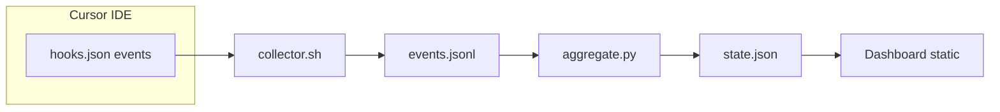

# Gamified Cursor Dashboard — Implementation Plan

> **For agentic workers:** REQUIRED SUB-SKILL: Use `@superpowers/subagent-driven-development` (recommended) or `@superpowers/executing-plans` to implement this plan task-by-task. Steps use checkbox (`- [ ]`) syntax for tracking.

**Goal:** Ship a local, gamified developer dashboard driven by Cursor Hooks, with XP/levels, achievements, streaks, and per-project stats, exposed as interactive web UI(s) that feel good to use.

**Architecture:** Hooks invoke a single collector that appends normalized JSON lines to `~/.cursor/dashboard/events.jsonl`. A Python aggregator replays the log (deterministic, idempotent) and writes `~/.cursor/dashboard/state.json`. The dashboard is static assets + client-side JS (built from the repo) served locally (e.g. `python3 -m http.server` or a tiny static server) so `fetch("./state.json")` stays same-origin. Install/deploy copies or symlinks artifacts from this repo into `~/.cursor/`.

**Tech Stack:** Bash + `jq`; Python 3.11+ (`pytest` for aggregator); Node 20+ with **Vite + TypeScript** for the dashboard (better structure and UX than a single giant HTML file while still emitting static files). Optional: `uv` or `pip` for Python deps if kept minimal (stdlib-only preferred for aggregator).

**Canonical paths (runtime):**

| Role             | Path                                                                   |
| ---------------- | ---------------------------------------------------------------------- |
| Hook config      | `~/.cursor/hooks.json`                                                 |
| Collector        | `~/.cursor/hooks/collector.sh`                                         |
| Event log        | `~/.cursor/dashboard/events.jsonl`                                     |
| Aggregator       | `~/.cursor/dashboard/aggregate.py` (installed copy or symlink to repo) |
| Game state       | `~/.cursor/dashboard/state.json`                                       |
| Dashboard static | `~/.cursor/dashboard/` (e.g. `index.html`, assets)                     |

---

## File structure (repository)

Design the repo so **source** and **runtime** are clearly separated:

```text
cursor-dashboard/
├── specs.md                          # existing spec (reference)
├── README.md                         # install, dev, open dashboard
├── scripts/
│   ├── install.sh                    # copy/symlink hooks + dashboard + aggregator to ~/.cursor/
│   └── dev-server.sh                 # optional: serve ~/.cursor/dashboard on fixed port
├── collector/
│   └── collector.sh                  # source for ~/.cursor/hooks/collector.sh
├── aggregator/
│   ├── aggregate.py                  # CLI entry (thin)
│   ├── pyproject.toml or requirements-dev.txt
│   └── src/aggregator/               # package layout (recommended)
│       ├── __init__.py
│       ├── xp.py                     # level curve, XP_RULES
│       ├── achievements.py           # catalog + progress + unlock logic
│       ├── replay.py                 # single pass over events → metrics + XP from events
│       ├── state.py                  # build state.json + merge preserved unlock metadata
│       └── hooks_schema.py           # optional: documented field names per hook_event_name
├── dashboard/                        # Vite + TS app
│   ├── package.json
│   ├── vite.config.ts
│   ├── index.html
│   └── src/
│       ├── main.ts
│       ├── state.ts                  # types mirroring spec §5
│       ├── api.ts                    # loadState + polling
│       ├── components/               # layout, tabs, cards, charts
│       └── styles/                   # CSS variables, dark theme (spec §8 as baseline)
└── docs/superpowers/plans/
    └── 2026-03-30-cursor-dashboard.md  # this plan (after approval)
```

**Build output:** `dashboard/dist/` → copied to `~/.cursor/dashboard/` during `install.sh` (alongside generated `state.json` once aggregator runs).



---

## Spec gaps to close (non-negotiable for correctness)

1. **Collector sample in spec** ([specs.md](specs.md) L92–98): The embedded `jq` / shell snippet is broken (`\` keys, `> >` redirection). Implementation must output **one compact JSON object per line** with `_ts` (ISO UTC) and `_project` (from first `workspace_roots` segment).
2. **Aggregator sample**: The pasted `aggregate.py` is truncated and contains logic bugs (e.g. “daily login” tracking via `getattr(aggregate, "_login_days", …)` is incorrect). **Replay model:** one forward pass over `events.jsonl` building counters and event-sourced XP; then apply achievement XP with **merge** from previous `state.json` for unlock timestamps (per spec §10 table).
3. **Full achievement catalog** ([specs.md](specs.md) §4): Implement all listed IDs with `check` + **progress** for `in_progress` (dashboard already renders progress bars). Subset in sample code is insufficient.
4. **Hook field coverage:** Implement parsers for each row in §1 (e.g. `postToolUse` → MCP bonus if `tool_name` matches MCP pattern; `afterShellExecution` → test/build XP only when success is knowable from payload per real Cursor hook JSON — **verify against actual hook payloads** and document assumptions in `README.md`).
5. **`recent_events` and `today.xp_earned`:** Spec schema includes them; aggregator must populate (cap `recent_events` length, e.g. 50).
6. **Trigger:** Spec §7 suggests running aggregator after `sessionEnd` / `stop` from collector; implement in `collector.sh` (background `python3 aggregate.py`).

---

## Implementation phases (bite-sized)

### Phase 1 — Repository scaffold

- Initialize `aggregator` with `pyproject.toml` (package + pytest + ruff optional).
- Initialize `dashboard` with Vite + TypeScript (`npm create vite@latest`).
- Add root `README.md` with prerequisites and “first run” flow.
- **Verify:** `pytest` runs (empty), `npm run build` produces `dashboard/dist/`.

### Phase 2 — Collector (TDD where feasible)

- **Test:** Golden-file test: stdin JSON + assert stdout line matches `jq -c` schema (or integration test invoking `bash collector.sh < fixture.json`).
- **Implement:** `collector/collector.sh`: read stdin, append to `LOG_FILE`, derive `_project`, add `_ts`, optional `aggregate` trigger on `sessionEnd` / `stop`.
- **Deliver:** `hooks.json.example` in repo (user copies to `~/.cursor/hooks.json` or install script merges).

### Phase 3 — Event replay + XP (Python)

- **Test first:** Small `events.jsonl` fixtures → expected `lifetime` counters and XP-from-events totals.
- **Implement:** Split modules: `replay.py` handles `hook_event_name` exhaustive switch (`@typescript-exhaustive-switch` pattern in Python: `match` + no default for unknown names logging a warning).
- **Implement:** `xp.py`: `xp_for_level`, `level_from_xp`, constants from spec §3.
- **Verify:** `pytest` green on fixtures.

### Phase 4 — Achievements + state merge

- **Test:** Unlock when threshold crossed; second run does not duplicate XP; timestamps preserved from prior `state.json`.
- **Implement:** `achievements.py` driven by data (JSON or Python list) from spec §4; `state.py` builds full `state.json` per spec §5 including `streaks`, `projects`, `recent_events`.
- **Edge cases:** `current_clean_streak`, `comeback`, `multi_project`, `subagent_parallel`, `night_owl` / `early_bird` require session timestamps and per-session buckets — derive from replayed events + explicit session model if needed.

### Phase 5 — Aggregator CLI

- **Implement:** `aggregate.py` reads `EVENTS_FILE` / writes `STATE_FILE` (paths configurable via env for tests).
- **Verify:** End-to-end fixture: `events.jsonl` → `state.json` snapshot test (stable ordering for dict keys or compare parsed JSON semantically).

### Phase 6 — Dashboard UI/UX

- **Types:** Mirror `state.json` TypeScript interfaces from spec §5.
- **Features:** Tabs (Overview / Achievements / Projects / Lifetime), XP bar, breakdown bars, streak, today grid, activity feed, language bars, toast diff on poll (level up / new achievement), polling ~30s + manual refresh — as in spec §8.
- **Polish:** Responsive layout, focus states, reduced motion respect, empty states — user asked for “look and feel good”; go beyond spec’s baseline CSS where cheap (spacing, typography, micro-interactions).
- **Verify:** `npm run build`; open built `index.html` via local server against a fixture `state.json`.

### Phase 7 — Install and developer workflow

- **`scripts/install.sh`:** Create dirs, copy `collector.sh`, link or copy `aggregate.py` / package, copy `dashboard/dist`, print reminder to merge `hooks.json`.
- **Document:** Cursor version requirements, security note (local-only, no telemetry), how to re-run aggregator manually, optional cron (spec §6–7).

---

## Task checklist (representative steps; expand per `@writing-plans` in saved doc)

Each task follows: failing test → implement → run tests → commit.

| Task | Outcome                                                |
| ---- | ------------------------------------------------------ |
| T1   | Repo scaffold + CI script (pytest + npm ci + build)    |
| T2   | `collector.sh` + example `hooks.json` + stdin/out test |
| T3   | `replay.py` + XP from events + pytest fixtures         |
| T4   | `achievements.py` + merge + full catalog               |
| T5   | `state.py` + `recent_events` + `today`                 |
| T6   | `aggregate.py` CLI + snapshot tests                    |
| T7   | Vite dashboard + parity with spec UI                   |
| T8   | `install.sh` + README                                  |

---

## Testing commands (expected)

```bash
cd aggregator && pytest -q
cd dashboard && npm test  # if added; else npm run build
```

---

## Execution handoff (after plan is saved)

**Plan complete** (to be saved as `docs/superpowers/plans/2026-03-30-cursor-dashboard.md` after you confirm). Two execution options:

1. **Subagent-driven (recommended)** — `@superpowers/subagent-driven-development`: one subagent per task, review between tasks.
2. **Inline execution** — `@superpowers/executing-plans`: batches with checkpoints in one session.

**Optional:** Run `@brainstorming` in a **git worktree** before implementation if you want to split achievements engine vs UI into parallel tracks.
