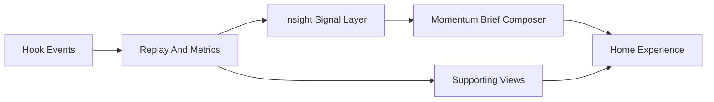

# Momentum Home Redesign Plan

## Outcome
Create the first real `Momentum` product experience: a premium, coherent home screen that interprets recent developer behavior into a concise `Momentum Brief`, supported by trustworthy evidence and a clearer supporting information architecture.

## Why This Next
This plan follows the documented product direction:
- `docs/north-star/mission-and-values.md` says users should understand how they are growing, see proof of progress, and know how to keep leveling up.
- `docs/product/roadmap-now-next-later.md` prioritizes `insight quality` before `progression and momentum`, then `outcome intelligence`.
- `docs/memory/agent-handoff.md` calls out richer insight mechanics, comeback/momentum design, and stronger outcome interpretation as the next recommended discussions.
- `docs/product/feature-opportunities.md` already points to relevant candidate concepts such as `Improvement Narratives`, `Workflow Signature Cards`, `Focus Prompt Of The Week`, `Project Growth Stories`, and `Build And Test Confidence Signals`, but they remain `discussing` and should be implemented only through the approved design from this brainstorming.

## Existing Systems To Leverage
- Dashboard shell and rendering in [dashboard/src/app.ts](dashboard/src/app.ts)
- Dashboard data contract in [dashboard/src/types.ts](dashboard/src/types.ts)
- Dashboard fetching and source switching in [dashboard/src/api.ts](dashboard/src/api.ts) and [dashboard/src/data-source.ts](dashboard/src/data-source.ts)
- Aggregated state creation in [aggregator/src/aggregator/state.py](aggregator/src/aggregator/state.py)
- Event replay and derived metrics in [aggregator/src/aggregator/replay.py](aggregator/src/aggregator/replay.py)
- Achievement and streak logic already available in [aggregator/src/aggregator/achievements.py](aggregator/src/aggregator/achievements.py)
- Current visual baseline in [dashboard/src/styles/app.css](dashboard/src/styles/app.css)

## Boundaries
In scope:
- define the product identity and experience rules for the new home
- add a first-pass insight model that turns existing telemetry into interpretable signals
- redesign the home around `signal -> meaning -> next move -> evidence`
- reposition existing views like projects/progress/history/achievements as supporting destinations
- update product-memory docs as implementation changes what is materially true

Out of scope for this initiative:
- full stage-aware adaptation engine
- social or leaderboard mechanics
- heavy AI-generated coaching or chat personas
- broad collector changes unless a missing signal is essential
- complete rewrite of every secondary screen before the home experience proves out

## Proposed Architecture

The implementation should introduce a narrow interpretation layer between replayed metrics and the dashboard UI. That layer should compute a small set of product-facing signals such as `consistency`, `recovery`, `focus`, `validation`, `projectMomentum`, and `growthDirection`, then assemble a concise home brief with one recommended next move only when the evidence is strong enough.

## File Structure Map
Expected primary touch points:
- Modify [dashboard/src/app.ts](dashboard/src/app.ts): replace the current equal-weight dashboard-first home with a guidance-led home layout and supporting navigation
- Modify [dashboard/src/styles/app.css](dashboard/src/styles/app.css): introduce the branded visual system, layout hierarchy, and calmer semantic styling
- Modify [dashboard/src/types.ts](dashboard/src/types.ts): extend the dashboard contract for insight signals and brief content
- Modify [aggregator/src/aggregator/state.py](aggregator/src/aggregator/state.py): include the new interpreted signal payload in generated state
- Modify [aggregator/src/aggregator/replay.py](aggregator/src/aggregator/replay.py): derive the reusable signal inputs from existing event history
- Add a focused insight module under `aggregator/src/aggregator/` for signal computation and brief composition, rather than expanding `replay.py` into one larger responsibility
- Add focused dashboard view modules under `dashboard/src/` if `app.ts` becomes too large to safely evolve as the new home experience is introduced
- Update docs such as [docs/product/current-state.md](docs/product/current-state.md), [docs/product/implemented-features.md](docs/product/implemented-features.md), [docs/memory/agent-handoff.md](docs/memory/agent-handoff.md), and [docs/memory/decision-log.md](docs/memory/decision-log.md) once behavior and product direction are materially changed

## Implementation Sequence
1. Define the product identity foundation.
- Capture the approved product language for `momentum`, `focus`, `recovery`, `validation`, and `confidence`.
- Define the home-screen hierarchy, supporting view roles, and design principles that will govern implementation choices.
- Convert that into a durable markdown spec before code changes spread.

2. Design the home experience before broad refactors.
- Create and validate the `Momentum Brief` home structure, including hero brief, evidence strip, recent change area, project focus area, and routes or tabs for deeper exploration.
- Use visual concepts to validate hierarchy, density, and brand expression before deeply wiring implementation.

3. Build the insight signal layer.
- Derive a small set of evidence-backed signals from existing metrics.
- Add confidence thresholds and null states so the product can say less when the evidence is weak.
- Compose brief copy from structured signal output rather than ad hoc UI text.

4. Implement the new home UI and supporting IA refresh.
- Replace the current stats-first entry experience with the new home.
- Demote XP/streaks/achievements from primary emotional center to supporting proof.
- Reframe projects, progress, history, and achievements around the new narrative structure.

5. Verify and document.
- Run the relevant dashboard build/tests and recently affected backend tests.
- Manually review the home for clarity, premium feel, and narrative flow.
- Update product-memory docs to keep implemented behavior and next-step recommendations current.

## Verification Expectations
- Dashboard build passes for the redesigned UI.
- Focused aggregator coverage for the redesigned insight layer passes; broader `aggregator/tests` collection currently has an unrelated runtime import failure and should not be treated as proof that the full suite is green.
- The home screen can be understood quickly: what changed, why it matters, and what to do next.
- Guidance is evidence-backed and sparse enough to avoid preachiness.
- The final UI feels coherent and branded rather than like a recolored telemetry dashboard.

## Risks To Manage
- Overstating what the telemetry can really infer.
- Making the UI look more polished without improving meaning.
- Preserving too much equal-weight card structure from the current dashboard.
- Letting XP/streaks remain the emotional centerpiece despite the new mission.
- Expanding scope into full stage adaptation before the home and insight layer are validated.

## Suggested First Milestones
- Milestone 1: approved experience and visual spec for the home and design language
- Milestone 2: implemented insight signal payload and brief contract in the aggregator/state schema
- Milestone 3: implemented branded home experience using the new contract
- Milestone 4: supporting views reframed and docs updated
