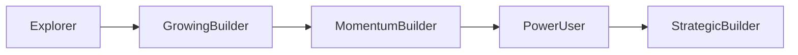
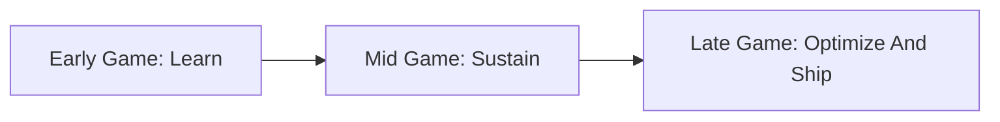

# Cursor Dashboard gamification brainstorming
_Exported on 3/31/2026 at 08:35:44 GMT+2 from Cursor (2.7.0-pre.168.patch.0)_

---

**User**

/brainstorming Now that we have the basic Cursor Dashboard setup with real global live data that gets aggregated and shown on the webpage, let's make this the most personalized, fun, useful gamified Dashboard to motivate developers to keep their momentum going when using Cursor. I want us to brainstorm new features or changes that would 10x the app's feel and usefulness so they feel a sense of progress, empowerment (since the app reveals things to them that they couldn't have known otherwise, and definitely not in one centralized and fun place) and achievement. Let's think about actual user intent (or derived from usual SWE behavior), user flows that match these intent, and that fits different personas at different stages. I also want you to perform Deep Research about most effective Game Mechanics, Octalysis Framework and proven Game Design Principles off of scientific research papers.

Your task will also be to make a "/docs" folder organized by subfolders to document:
- The app's intention, mission and values I mentioned (I want you to enhance it a lot based on what I said and what you think would make it comprehensive, appealing and useful to read as a north star for any other agent that will build features for this project)
- Personas at different stages, their behaviors etc. I want you to use a standardized personas structure (that you'll search the web for to use the best one)
- The results of your Deep Research on game mechanics, game design and gamification principles that you think would be extremely useful to go back to at any point when building/enhancing features for this Cursor Dashboard and our users.

I also want a forward-thinking mechanism in the project for Cursor so agents always know where we are at, the features that are currently implemented, and the ones to discuss, plan or build next, so agents don't forget context between conversations. Basically a project memory for agents and me developing it between sessions.

---

**Cursor**

I’m starting by grounding in the current dashboard setup and docs so I can brainstorm from the real project shape rather than abstract ideas.

Some of what we're working on might be easier to explain if I can show it to you in a web browser. I can put together mockups, diagrams, comparisons, and other visuals as we go. This feature is still new and can be token-intensive. Want to try it? (Requires opening a local URL)

---

**User**

For now let's not use mockups, but I'm okay if you want to show Mermaid diagrams in markdown or others as we go. Ask me again if you ever think it's relevant to do.

---

**Cursor**

I’ve got enough context on the current dashboard shape to start refining the product direction in text-first mode.

**Cursor Dashboard Direction**

> **What should this dashboard optimize for first in the next iteration?**
> - Daily motivation and momentum: make me want to come back and keep a streak going
> - Self-insight and reflection: show me patterns about how I actually work with Cursor
> - Execution guidance: tell me what I should do next to stay effective
> - A balanced mix of all three, without over-optimizing one
>
> Answer: I don't know which direction to go to, that's precisely why I want to brainstorm with you first. What do you think would make it the best first iteration?

For the best first iteration, I’d optimize for `self-insight` first, then layer `motivation`, then a light amount of `execution guidance`.

Why: the app’s unfair advantage is that it can reveal patterns a developer cannot easily see on their own across sessions, tools, models, projects, streaks, and recovery cycles. If the first version feels genuinely insightful, the gamification becomes meaningful rather than superficial. Then motivation mechanics can amplify behavior people already trust, and guidance can stay lightweight so it feels empowering rather than preachy.

The next question that will shape almost everything is who we should design the primary experience around first.

---

**User**

Excellent thinking, let's continue

---

**Cursor**

I’m narrowing the target user so the feature set doesn’t turn into a vague “everything dashboard.”

**Primary Persona**

> **Which developer persona should we design the first-class experience around first?**
> - A solo power user who uses Cursor heavily every day and wants mastery, momentum, and optimization
> - A developer actively leveling up with AI tools who wants confidence, feedback, and proof of progress
> - A busy professional who wants quick summaries, focus, and practical signals without much friction
> - A hybrid dashboard that supports all three, but with one clear primary persona and lighter support for the others
>
> Answer: I think we should first target a developer actively leveling up with AI tools like Cursor (since it's still relatively new to the world), and gradually as the "game" progresses the person themself will become a solo power user who uses Cursor heavily every day. So I think we can mimick an MMORPG progression where the player progresses from start of the game to endgame and becomes a power user as they progress. What do you think about this approach? Which persona would you pick?

I think that’s the strongest direction.

I’d pick `growing_builder` as the primary starting persona, but explicitly design the product arc so the user “graduates” into `solo_power_user`. That gives the dashboard a real progression fantasy instead of a static persona snapshot. In practice, that means early experiences should reduce ambiguity, celebrate learning, and surface understandable wins, while later experiences unlock mastery views, optimization loops, and harder challenges. That MMORPG framing is especially good here because Cursor usage naturally evolves from experimentation to fluency to systemized leverage.

The next important choice is what kind of progression should be most central in that journey.

---

**User**

Continue

---

**Cursor**

I’m now choosing the core progression lens, since that will determine whether the mechanics feel meaningful or just decorative.

**Core Progression Loop**

> **What should feel like the main form of progression in the dashboard?**
> - Capability mastery: I am becoming better at using Cursor and AI coding workflows
> - Consistency and momentum: I am building a durable habit and staying in motion
> - Project outcomes: I am shipping more meaningful work with Cursor
> - A blended arc: start with capability mastery, reinforce consistency, and later emphasize project outcomes ✔

That’s the right choice. A `blended_arc` fits your MMORPG idea much better than a single-axis system:

- Early game: teach capability mastery so users feel “I’m learning how to use Cursor well.”
- Mid game: reinforce consistency so they feel momentum and identity forming.
- Late game: shift toward project outcomes so the dashboard proves this skill translates into real leverage.

That gives us a clean backbone for personas, feature sequencing, and the research lens for game design.

The next decision is about tone, because the same mechanics can feel either inspiring or cheesy depending on how we frame them.

---

**User**

Continue

---

**Cursor**

I’m locking tone next so later mechanics, personas, and docs all point in the same emotional direction.

**Product Tone**

> **What tone should the dashboard lean toward most strongly?**
> - Serious coach: insightful, performance-oriented, and grounded
> - Playful RPG: fun, rewarding, identity-driven, and clearly game-like
> - Clean premium: elegant, motivating, and understated rather than overtly gamey
> - Hybrid: credible and useful first, but with playful game flavor layered on top
>
> Answer: Hmm, I need to know about your extensive thoughts on it so you help me make an informed decision by taking into account what all of them leads to and why. One thing I'd say is that I don't want this Dashboard to only appeal to Gamers or people in the video game "life". I want it to be used by top 1% SWE at Fortune 500 companies and solo devs building SaaS companies who want to change the world by going from idea to product and help real people solve their pains and problems. The app shouldn't feel childish but add a cherry on top of what they already do, without being too "corporately boring" but fun!

My recommendation is `hybrid`, with a strong bias toward `clean premium`.

Here’s why the other tones fall short for your audience:

- `Serious coach` would make the product broadly respectable, but it risks flattening the magic. You’d get utility, but not much delight or identity. It could easily drift into “analytics dashboard with productivity advice.”
- `Playful RPG` creates strong emotional engagement and clearer progression, but it narrows the audience too much. Top-tier engineers, founders, and ambitious professionals may enjoy game mechanics, but many will reject something that feels childish, loud, or culturally coded as “for gamers.”
- `Clean premium` is the safest fit for ambitious professionals and founders. It signals taste, confidence, and seriousness. But by itself it can become too restrained, and then the app loses some of the motivational energy that makes gamification worthwhile.

So the best path is:

- Core product feel: polished, intelligent, aspirational, and emotionally mature.
- Game layer: subtle but real. Progression, milestones, momentum loops, unlocks, mastery tracks, and occasional delight.
- Writing style: concise, sharp, empowering, never cartoonish.
- Visual language: premium dashboard first, game flavor second.
- Emotional promise: “This makes me feel sharper, more capable, more in command” rather than “this is cute and fun.”

In other words, the app should feel less like a toy and more like a personal command center for becoming an elite AI-native builder, with just enough game design to make progress visceral.

A useful framing is:
- `Serious on the outside`
- `Motivating and gameful underneath`
- `Never juvenile`
- `Never sterile`

If you want, I can now turn that into 3 concrete product directions with trade-offs and recommend one as the north-star concept.

---

**User**

I think that's the best compromise for what we want to achieve! Let's continue

---

**Cursor**

I’ve got enough signal now to frame concrete directions instead of asking more abstract questions.

Here are the three strongest product directions I see, ordered by recommendation.

## Option 1: AI-Native Builder Journey
This is my recommendation.

The dashboard becomes a progression system for becoming an elite AI-assisted developer. The core fantasy is not “I grind points,” but “I am evolving from experimenting with Cursor into someone who can reliably turn ideas into shipped outcomes.” Early features focus on understanding your behavior and teaching better patterns. Mid-stage features reinforce momentum, confidence, and practice. Late-stage features surface mastery, leverage, and strategic optimization.

What it would emphasize:
- Progression lanes like `Learn`, `Build`, `Ship`, `Master`
- Milestones tied to meaningful behavior, not vanity numbers
- Insight cards that explain what changed and why it matters
- Unlockable advanced views as the user matures
- A project memory layer so the app also acts like a long-term companion for development

Strengths:
- Best fit for your persona arc from growing builder to power user
- Makes gamification feel purposeful and aspirational
- Works for founders, ambitious ICs, and serious engineers
- Gives a strong north star for docs, personas, and roadmap memory

Risks:
- Harder to design well because the progression has to feel authentic
- Requires discipline so “journey” does not become vague branding

## Option 2: Personal Cursor Coach
This version is more performance-oriented. The dashboard acts like a reflective coach that studies your Cursor behavior, identifies patterns, and nudges you toward better habits. Gamification is secondary and mostly appears as reinforcement rather than identity.

What it would emphasize:
- Behavioral insights and recommendations
- Session quality, recovery patterns, tool effectiveness, and model usage signals
- Focus prompts like “you do better when you start with X” or “your best sessions share Y”
- Light streaks, achievements, and progression

Strengths:
- Strong credibility with serious professionals
- Easier to justify with research and evidence
- More obviously useful from day one

Risks:
- Less emotionally magnetic
- More likely to feel like productivity software with a gamified skin
- Weaker long-term fantasy and differentiation

## Option 3: Builder Command Center
This version treats the dashboard as a strategic HQ for all activity around AI-assisted software creation. It combines project awareness, personal metrics, progress tracking, and next-step planning into a single operating console. Gamification exists, but mostly to make the command center feel alive.

What it would emphasize:
- Cross-project visibility
- Goal tracking and feature progress
- “What changed,” “what’s next,” and “where momentum is strongest”
- Agent memory and roadmap state
- A premium, high-agency feel

Strengths:
- Very useful and extensible
- Naturally supports the project-memory requirement
- Great fit for founders and multi-project builders

Risks:
- Can become too broad too early
- More danger of feeling like a project management tool
- Gamification may feel bolted on unless carefully integrated

## Recommendation
I’d choose `Option 1: AI-Native Builder Journey`, while borrowing selected elements from the other two:

- From `Personal Cursor Coach`: the insight engine and evidence-based nudges
- From `Builder Command Center`: the project memory and roadmap awareness layer

That combination gives you the strongest emotional positioning:
this is the place where a developer sees themselves becoming more capable, more consistent, and more effective with Cursor over time.

If that direction looks right, I’ll present the first design section: the product north star, mission, and the core user promise.

---

**User**

That direction looks right! Continue

---

**Cursor**

I’m turning the chosen direction into a concrete north star before we get into mechanics, personas, and docs structure.

## Design Section 1: North Star

### Product Positioning
`Cursor Dashboard` should become a personal progression system for the AI-native builder.

Not just a stats page.
Not just a gamified wrapper around usage metrics.
Not just a productivity coach.

It should feel like the place where a developer can finally see:
- how they are evolving with Cursor over time
- how their real behaviors connect to mastery, momentum, and shipping
- what patterns make them stronger, faster, and more effective
- what they have already achieved, and what frontier comes next

### Core User Promise
When someone opens the dashboard, the feeling should be:

“I understand how I’m growing with Cursor, I can see proof of progress, and I know how to keep leveling up.”

That promise has three layers:
- `Insight`: reveal things the user could not easily know from raw memory or scattered sessions
- `Motivation`: make progress emotionally tangible without feeling childish
- `Empowerment`: turn reflection into confidence and better decisions

### Mission
Help developers become more capable, consistent, and high-leverage with AI coding tools by making invisible progress visible.

### Vision
Over time, the dashboard becomes a trusted system of record for a developer’s AI-assisted growth:
- from early experimentation
- to deliberate skill-building
- to confident, high-output, high-judgment product creation

### Values
- `Truth over vanity`: metrics should reflect meaningful behavior, not empty engagement bait
- `Empowerment over manipulation`: motivate users without exploiting compulsive loops
- `Clarity over noise`: every feature should help users understand something important
- `Progress over perfection`: celebrate recovery, learning, and consistency, not just flawless output
- `Professionalism with delight`: premium and credible first, playful second
- `User sovereignty`: the dashboard supports the developer’s goals; it does not hijack them

### Strategic Implication
This means the product should reward:
- learning better workflows
- building durable habits
- recovering from slumps
- shipping real work
- growing into mastery

And it should de-emphasize:
- shallow point farming
- noisy badges with no behavioral meaning
- childish game tropes
- corporate KPI overload

This section would become the backbone for the `/docs` north-star material and for future agents deciding whether a feature belongs in the product.

Does this north-star section look right so far?

---

**User**

Looks on point! I think you understood very well what we're trying to achieve.

---

**Cursor**

I’m moving from the north star into the actual experience structure: who the dashboard serves, how they progress, and what the product needs to do at each stage.## Design Section 2: Persona Arc And Experience Stages

Instead of treating personas as fixed user types, I think this product should treat them as `progression stages`. That matches your MMORPG framing and fits how developers actually evolve with new tools like Cursor.

### Primary Progression Arc
The main journey would be:

1. `Explorer`
The user is curious about Cursor, experimenting, and still unsure what “good” usage looks like. They need encouragement, orientation, and proof that they are improving.

2. `Growing Builder`
The user is actively using Cursor to learn faster and build more. They want feedback loops, confidence, and visible signs that they are becoming more capable.

3. `Momentum Builder`
The user has some competence and now needs consistency. Their challenge is less “can I use Cursor?” and more “can I sustain strong habits, avoid drift, and keep shipping?”

4. `Power User`
The user uses Cursor deeply and regularly. They care about leverage, optimization, nuanced behavioral patterns, and mastery-level insights.

5. `Strategic Builder`
This is the late-game identity: someone using Cursor not just frequently, but intentionally, to create outsized outcomes across projects, products, or teams.

### Why this structure is better than static personas
A static persona system would say “this user is X.”
A stage-based system says “this user is becoming Y.”

That matters because your product is about transformation. The dashboard should not just describe the user; it should help move them forward.

### What each stage needs from the product
`Explorer`
- reassurance
- beginner-friendly signals
- simple wins
- low-friction explanations
- visible progress from small actions

`Growing Builder`
- skill validation
- momentum tracking
- evidence that better workflows are forming
- encouraging but credible rewards

`Momentum Builder`
- habit reinforcement
- recovery support after off days
- clearer connection between consistent use and real output

`Power User`
- advanced pattern recognition
- comparative self-analysis over time
- system optimization opportunities
- harder mastery challenges

`Strategic Builder`
- outcome-oriented reflection
- cross-project clarity
- higher-level leverage signals
- long-range development memory

### Product implication
The dashboard should adapt its emphasis by stage.

A simple way to think about it:



And the value emphasis shifts like this:



So:
- early game emphasizes `capability mastery`
- mid game emphasizes `consistency and identity`
- late game emphasizes `project outcomes and leverage`

### Supporting personas
Even with this main arc, we should still support two secondary lenses:
- `Busy professional`: wants fast summaries and practical clarity
- `Ambitious founder / solo dev`: wants momentum tied to product outcomes and long-range ambition

But these should be secondary overlays, not the main progression structure.

### Documentation implication
For the `/docs` area, I’d recommend documenting both:
- `stage-based personas` as the primary structure
- `context personas` like founder, IC, busy professional as secondary situational lenses

That gives agents a much better framework for feature decisions:
they can ask both “what stage is this for?” and “what work context is this for?”

Does this persona-and-progression-stage section look right so far?

---

**User**

Looks great! I think you don't have to validate each section with me now, as you understood everything very well, I'm sure of it. So move forward to what you planned to do

---

**Cursor**

I’m moving into the evidence layer now so the concept is anchored in proven motivation design rather than generic gamification.

I’ve got a first evidence base; now I’m checking for the main failure modes so we can avoid shallow or manipulative mechanics in the design.

## Design Section 3: Game Design Principles For This Product

Here’s the most important conclusion from the research: this dashboard should use `deep gamification`, not `shallow gamification`.

Shallow gamification is the usual points, badges, and leaderboards layer. It can create short-term activity, but it often fails to create durable meaning, and in some cases it can even weaken intrinsic motivation when the rewards feel controlling or arbitrary. That is especially risky for serious developers, who are sensitive to anything that feels manipulative, childish, or fake.

For this dashboard, the mechanics should support three psychological needs from Self-Determination Theory:
- `Autonomy`: the user feels in control, not managed by the app
- `Competence`: the user can clearly feel their skill growing
- `Relatedness / purpose`: the work feels connected to something meaningful, not just score accumulation

### What this means in practice

#### 1. Competence should be the dominant drive
This should be the heart of the product.

The dashboard must constantly answer:
- how am I getting better with Cursor?
- what can I do now that I could not do before?
- what patterns distinguish my best sessions from weaker ones?
- what evidence shows I am becoming more effective?

This aligns strongly with:
- SDT `competence`
- Octalysis `Development and Accomplishment`
- developer motivation research around mastery and challenge

So the best mechanics are not just `XP earned`, but:
- capability tracks
- milestone unlocks
- increasingly advanced mastery views
- “you’ve improved in X” explanations
- evidence-based progression summaries

#### 2. Progress visibility matters a lot
Research on the goal-gradient effect strongly supports making progress visible and near-term.

That means the dashboard should show:
- progress toward meaningful next milestones
- “almost there” states
- streak continuation and recovery opportunities
- mastery bars that have narrative meaning, not just filler percentages

But we should be careful:
progress bars should clarify progress, not create pressure for its own sake.

#### 3. Streaks should exist, but not dominate
Streaks are useful because they reinforce consistency and habit formation, but they become toxic when the whole product becomes “protect the streak at all costs.”

So streak design should be:
- supportive, not punitive
- framed around momentum and recovery
- resilient to missed days
- paired with comeback mechanics

This is important because your values are about `progress over perfection`.

#### 4. Rewards should mostly be informational and identity-building
The safest and strongest rewards here are:
- recognition of real growth
- access to richer insight views
- stage advancement
- new quests or focus paths
- narrative reframing of what the user is becoming

The riskiest rewards are:
- arbitrary points
- constant dopamine bait
- generic badges with no behavioral meaning
- heavy reliance on comparison or competition

#### 5. Avoid public competition as a core mechanic
Leaderboards are not a fit for the core product direction.

Even when they increase short-term activity, they often produce the wrong feeling for this audience:
- performative competition
- discouragement for non-top performers
- shallow comparison
- misalignment with personal mastery

This dashboard should be primarily `self-competitive`, not socially competitive:
- compare me to my past self
- compare this month to last month
- compare my best sessions to my default sessions
- compare current stage behaviors to the next stage’s patterns

### Octalysis mapping for this product
The most relevant Octalysis drives for the dashboard are:

- `CD2 Development and Accomplishment`
This should be central.
- `CD3 Empowerment of Creativity and Feedback`
Very important because Cursor usage is iterative and exploratory.
- `CD1 Epic Meaning and Calling`
Useful when tied to becoming an AI-native builder and building things that matter.
- `CD4 Ownership and Possession`
Useful in the form of personal progress, persistent profile, mastery map, and project memory.
- `CD5 Social Influence and Relatedness`
Should be secondary and subtle, if used at all.
- `CD6 Scarcity and Impatience`
Use sparingly, mostly for unlock sequencing rather than artificial FOMO.
- `CD7 Unpredictability and Curiosity`
Good for discovery and insight reveal moments.
- `CD8 Loss and Avoidance`
Should be used carefully. Recovery is better than punishment.

### Recommended principles
The product should optimize for:
- visible mastery
- meaningful milestones
- reflective insight
- resilient momentum
- identity growth
- recovery loops
- self-comparison over social comparison

And explicitly avoid:
- grindy point farming
- manipulative loss pressure
- juvenile badge spam
- meaningless competition
- gamification detached from real developer value

## Design Section 4: Core User Flows

The app should support a few high-value emotional jobs rather than a huge number of disconnected features.

### Flow 1: “Show me that I’m improving”
This is the signature flow.

User intent:
“I’ve been using Cursor a lot, but am I actually getting better?”

Best experience:
- dashboard opens with a concise progress summary
- user sees capability growth, momentum, and notable changes
- the system highlights one or two interpretable insights
- the user leaves feeling more confident and more intentional

This is the most important flow for the first iteration.

### Flow 2: “Help me regain momentum”
User intent:
“I drifted, had a rough session, or lost rhythm. Help me restart.”

Best experience:
- dashboard recognizes the break without shaming
- it frames recovery as part of mastery
- it offers an easy next milestone or comeback path
- it restores confidence quickly

This is where the product becomes emotionally intelligent instead of just analytical.

### Flow 3: “What kind of builder am I becoming?”
User intent:
“I want to understand my evolving identity with AI tooling.”

Best experience:
- stage progression is visible
- strengths and emerging patterns are surfaced
- advanced areas feel aspirational and unlockable
- the user sees a credible path from beginner to power user

This supports the MMORPG arc you want.

### Flow 4: “What should I focus on next?”
User intent:
“I understand the data, but what action would most help me level up?”

Best experience:
- the app suggests one or two next-step focus areas
- recommendations are grounded in observed behavior
- suggestions feel like guidance, not commands

This should be light-touch in v1, stronger later.

## Design Section 5: Feature Pillars

From all of that, I’d organize the product into five pillars.

### 1. Progression
Makes growth legible.
Examples:
- stage system
- levels and mastery lanes
- milestone paths
- unlockable views

### 2. Insight
Makes hidden patterns visible.
Examples:
- best-session pattern recognition
- model usage patterns
- recovery insights
- work-style signatures
- “things you do well with Cursor”

### 3. Momentum
Keeps the user moving without guilt.
Examples:
- streaks
- comeback mechanics
- weekly rhythm views
- momentum health indicators

### 4. Outcome
Connects behavior to real work.
Examples:
- project progression
- shipping-oriented milestones
- build/test/edit workflow quality
- project-specific growth stories

### 5. Memory
Preserves context across sessions for both humans and agents.
Examples:
- implemented features ledger
- current product direction
- discussed / planned / building / shipped states
- research archive
- open questions and future opportunities

## Design Section 6: Documentation System In `/docs`

I think the `/docs` area should be treated as a durable product brain, not just miscellaneous notes.

Recommended structure:

```text
docs/
  north-star/
    mission-and-values.md
    product-principles.md
    positioning.md
  personas/
    progression-stages.md
    context-personas.md
    user-jobs-and-flows.md
  research/
    gamification-foundations.md
    octalysis-framework.md
    motivational-psychology.md
    developer-motivation.md
    design-principles-summary.md
  product/
    current-state.md
    implemented-features.md
    roadmap-now-next-later.md
    open-questions.md
    feature-opportunities.md
  memory/
    agent-handoff.md
    decision-log.md
    glossary.md
```

### Why this structure works
- `north-star/` keeps mission drift under control
- `personas/` gives future agents a user-centered design lens
- `research/` prevents repeated re-discovery of the same motivation principles
- `product/` tells everyone where the app stands right now
- `memory/` gives continuity across sessions and agent conversations

## Design Section 7: Project Memory Mechanism

This should be a first-class system, not an afterthought.

I recommend a lightweight operating model with a few canonical files.

### Canonical memory files
- `docs/product/current-state.md`
What exists now, what is real, what is partial, what is missing.
- `docs/product/implemented-features.md`
Feature inventory with status and links to relevant files.
- `docs/product/roadmap-now-next-later.md`
A stable prioritization view.
- `docs/memory/agent-handoff.md`
The current working context for the next conversation.
- `docs/memory/decision-log.md`
Key product and technical decisions with rationale.

### Status model
Every feature or initiative should be tagged with a simple status:
- `implemented`
- `discussing`
- `planned`
- `building`
- `blocked`
- `shipped`
- `deprecated`

That gives both you and future agents a shared language.

### How agents should use it
At the start of future work, agents can answer:
- what is the product trying to become?
- what stage are we building for?
- what already exists?
- what decisions have already been made?
- what is the next highest-priority opportunity?

That solves the continuity problem much better than relying on chat memory alone.

## Strategic Synthesis

If I compress the whole direction into one sentence:

`Cursor Dashboard` should become a premium, insight-rich progression system that helps developers grow from curious AI-tool users into confident, high-leverage AI-native builders, while preserving a durable product memory for future development.

Next, I can turn this into:
1. a concrete research-backed feature framework for the first iterations
2. a docs architecture and memory operating model
3. an actionable plan for what to document and build first

